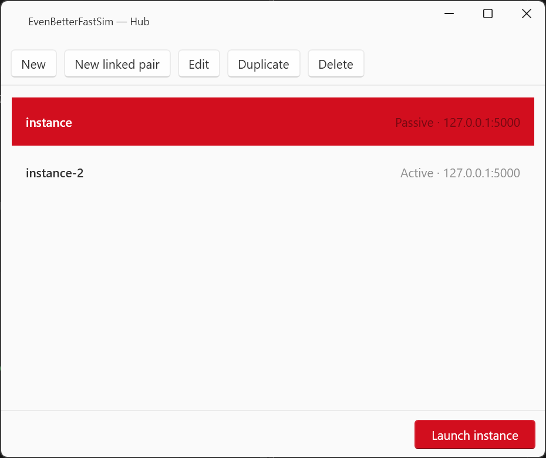
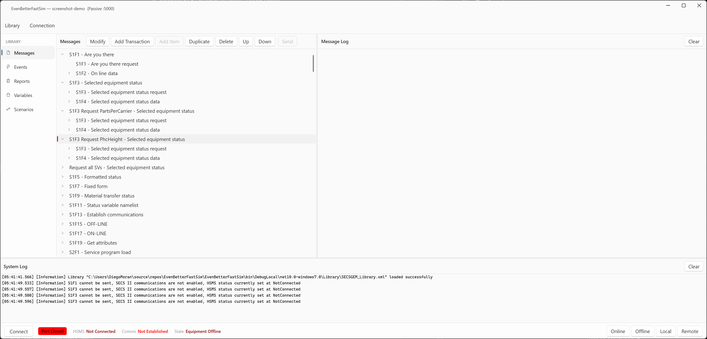
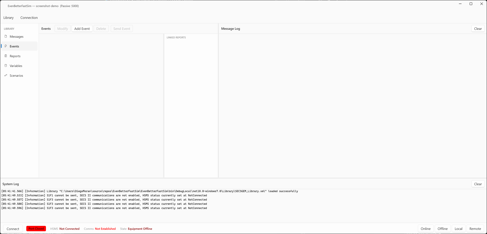
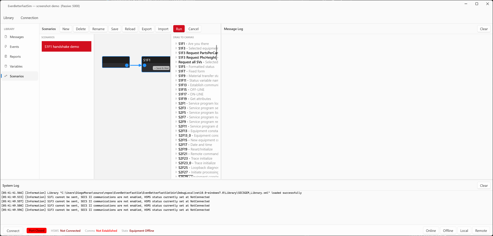

# EvenBetterFastSim: The reliable SECS/GEM tool
---------------------------------------------------------
EvenBetterFastSim is a desktop utility for emulating SEMI SECS/GEM equipment communication. It lets you emulate an equipment or host on your PC,
and exchange HSMS/SECS-II messages manually or create your own scripted scenarios.

## Features
----------
- HSMS (TCP/IP) communication with a live, timestamped message log
- An editable SECS/GEM message library loaded from XML (S1F1, S1F3, S2Fx, S6F11, …)
- Simulate workflows with multiple responses to a message using the **Scenario** canvas
- Create and define equipment events, reports and variables, and fire them as S6F11
- Run **multiple instances at once** (e.g. a Passive + Active pair) that talk to each other
- Control-state model (Online/Offline, Local/Remote) and configurable HSMS timers (T3–T8)

## Build and Debugging
-----------------------
Use Visual Studio 2026 to open the `.sln` file.

You may download [Visual Studio Community Edition](https://www.visualstudio.com/vs/community/) for free
to build, run or develop EvenBetterFastSim.

From the command line:

```bash
dotnet build EvenBetterFastSim.sln
dotnet run --project EvenBetterFastSim/EvenBetterFastSim.csproj
```

## Usage
--------
### 0. Download

You can download the application using the following link
[Releases · Pre-Se/EvenBetterFastSim](https://github.com/Pre-Se/EvenBetterFastSim/releases)

Download the **`.zip`** file: it contains the exe together with the default
message library (`Library\DefaultLibrary.msgpack`).
### 1. Pick or create an instance (the Hub)

Launching the app with **no arguments** opens the **Hub**. Each row is a named instance (a name plus an IP / port / connection mode/library); every profile launches as its own
process so you can run several simulators side by side.



- **New** – add a single profile.
- **New linked pair** – create a *Passive* + *Active* profile that share one endpoint, so
  the two instances connect to each other the moment you launch them.
- **Edit / Duplicate / Delete** – manage existing profiles.
- Select a profile and click **Launch instance** (or double-click it).

Profiles live in `%APPDATA%\EvenBetterFastSim\profiles\`. Launching with `--profile <name>`
skips the Hub and opens that instance directly.

### 2. The main window



| Area | What it does |
|---|---|
| **Left nav** | Switches the centre panel between **Messages**, **Events**, **Reports**, **Variables** and **Scenarios**. |
| **Centre panel** | The library for the selected section, with a toolbar (Add / Modify / Duplicate / Delete / Send …). |
| **Message Log** (right) | Every SECS-II and HSMS control message, newest in order, with a ↑/↓ direction icon and millisecond timestamp. Double-click an item to inspect its tree (values shown as hex or Base64). |
| **System Log** (bottom) | Human-readable status: library loaded, connection changes, send failures, etc. |
| **Status bar** | The port toggle button, the HSMS state (`Not Connected → Not Selected → Selected`), comms-established flag, control state, and the **Online / Offline / Local / Remote** buttons. |

The window title shows the profile name and its endpoint so instances are easy to tell apart.

### 3. Configure the connection

Open **Connection ▸ Properties** to set the IP address, port, connection mode
(**Passive** = listen, **Active** = dial out) and the HSMS timers (T3–T8), session id, etc.
When you launch from a Hub profile these are already filled in from the profile.

Click the port button in the bottom-left of the status bar to open/close the port. The
connection restarts automatically if you change a setting while it is open.

### 4. Send messages

In **Messages**, the tree is your SECS/GEM library (loaded from `Library\SECSGEM_Library.xml`
by default). Select a transaction and click **Send** — the primary message goes out and any
reply is paired up and shown in the Message Log. Use **Add Transaction / Add Item / Modify**
to shape the payloads, or **Library ▸ Save Library** to export your edits back to XML.

### 5. Events, Reports and Variables



Define status/data variables under **Variables**, group them into **Reports**, then attach
reports to a collection event under **Events**. **Send Event** builds and sends the
corresponding **S6F11** event report. (These lists start empty, populate them per your
equipment model.)

### 6. Scenarios



The **Scenarios** section is a visual node graph for multi-step exchanges. Drag a
transaction from the **DRAG TO CANVAS** palette onto the canvas, wire nodes from **Start**
to **End**, and press **Run** to execute them in order against the live connection.

Node types: **Send**, **Send & Wait** (send and wait for the reply), **Receive** (wait for a
matching incoming message, 30 s timeout) and **Wait** (a fixed delay). Scenarios are saved per instance and can be exported / imported.

### 7. Two instances talking

Create a **linked pair** in the Hub and launch both. One listens (Passive), the other dials
in (Active); once HSMS shows **Selected** on both, send a message from either side.